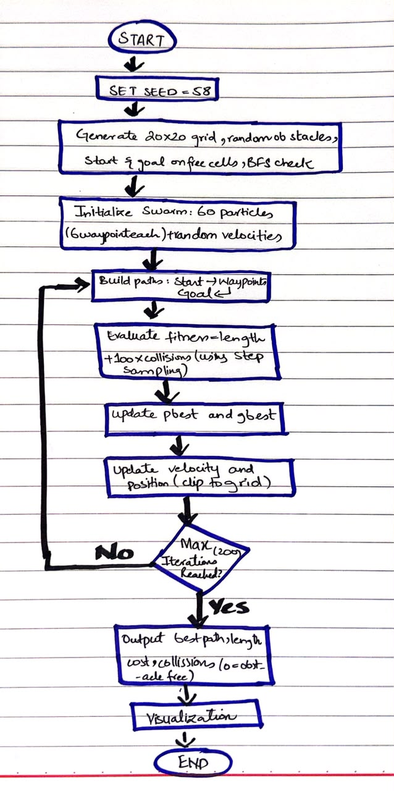

# Swarm-Based Path Planning with PSO

**Name:** Aiman Imtiaz Ranjha
**Roll Number:** 01-136232-058
**Random Seed Used:** 58 (last digits of my roll number), set with `random.seed(58)`
**Course:** Swarm Intelligence Lab, Assignment 1, Bahria University

## Problem

A 20x20 grid has randomly placed obstacles, a start cell, and a goal cell. The task is to find a short path from start to goal that does not touch any obstacle. Obstacles, start, and goal are all generated in code from `random.seed(58)` and nothing is hardcoded. Start and goal are always on free cells, and a BFS check makes sure a free route exists.

## Approach

I used Particle Swarm Optimization (PSO) with a continuous waypoint encoding:

1. **Particle:** each particle stores 6 intermediate continuous waypoints (x, y), represented by 12 coordinate values.
2. **Path building:** the path is Start -> waypoints -> Goal, joined by straight segments.
3. **Collision Checking:** I used a step-by-step mathematical sampling approach to check if any point along the line segments falls inside a blocked cell.
4. **Cost (lower is better):** path length + 100 x number of obstacle collisions. The massive penalty prioritizes finding obstacle-free paths before optimizing for length.
5. **Update rule:** each particle's velocity combines its old velocity (inertia, decreasing linearly from 0.9 to 0.4), a pull towards its own best position (c1 = 1.7), and a pull towards the swarm's global best position (c2 = 1.7). Velocity and position are clamped to stay inside the grid boundaries.
6. **Stopping:** the swarm evaluates 60 particles over 200 iterations.

## Hand-Drawn Flow Diagram



## How to Run

```bash
pip install matplotlib
python pso_path_planning.py

```

## Output
Seed: 58 | Start: (4, 7) | Goal: (18, 5)

--- RESULTS ---
Total Collisions: 0
Path Length: 14.443
Final Cost (Fitness): 14.443
Verdict: Obstacle-free path found!